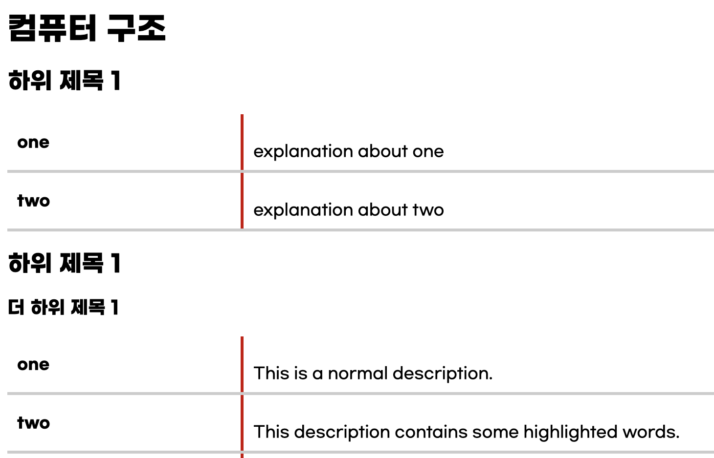
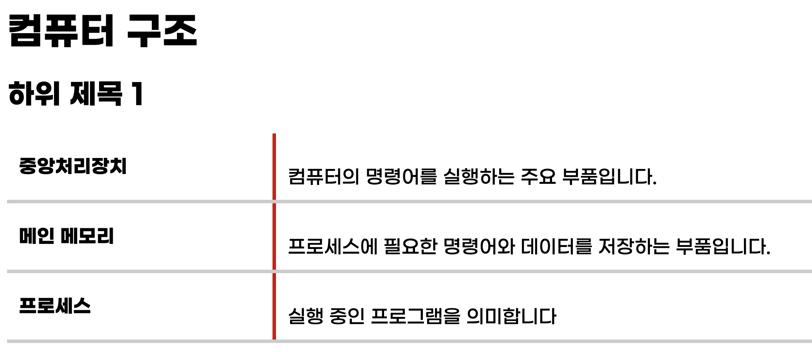
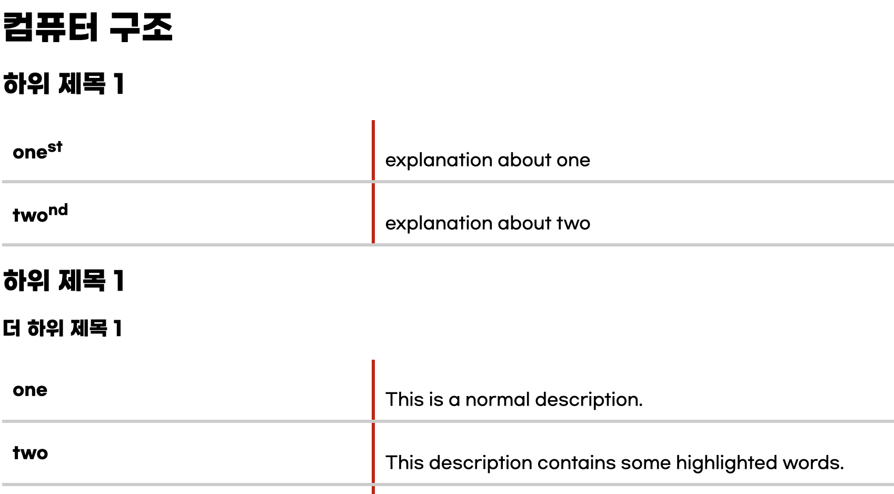

기여에 관심을 가져주셔서 감사드립니다.

## 로컬에서 실행하기

```
$ git clone https://github.com/kangtegong/csnote
$ cd 
$ python3 -m http.server
```

웹 브라우저 접속, http://127.0.0.1:8000에서 확인

## 과목 추가하기

각 과목은 하나의 yaml 파일로 구성되어 있고, 각 yaml 파일은 <b>subjects</b> 디렉터리에 있습니다.  
새로운 과목을 추가하고 싶다면 단순히 <b>assets</b> 디렉터리에 yaml 파일 만든 뒤, <b>config.json</b>에 해당 항목을 추가하면 됩니다.   
예를 들어 "ABC"라는 과목에 대한 정보를 포함하는 abc.yaml을 추가한 예시는 다음과 같습니다.

```json
{
  "version": "1.0.1",
  "subjects": [
    {"name": "컴퓨터 구조", "file": "arch.yaml"},
    {"name": "운영체제", "file": "os.yaml"},
    {"name": "네트워크", "file": "net.yaml"},
    {"name": "데이터베이스", "file": "db.yaml"},
    {"name": "자료구조", "file": "ds.yaml"},
    {"name": "ABC", "file": "abc.yaml"}  <= 추가
  ]
}
```


## 용어 추가/수정/삭제하기

누구나 쉽게 수정할 수 있도록 하기 위해 모든 과목은 하나의 yaml 파일로 이루어져 있습니다.

yaml 파일의 <b>title:</b>에는 과목명을 써 넣습니다.
<b>content:</b> 하단부터 원하는 정보를 추가해 나가면 됩니다.

```yaml
sections:
  - title: "컴퓨터 구조"
    content:
    ...
```


### 1. 하위 제목 쓰기

이때, 한 과목은 여러 하위 제목(subtitle)으로 나뉠 수 있습니다.  
그리고 세부 항목은 더 많은 하위 제목(subsubtitle)을 가질 수 있습니다.  


```yaml
sections:
  - title: "컴퓨터 구조"
    content:
      - subtitle: "하위 제목 1"
        items:
          - term: "one"
            description: "explanation about one"
          - term: "two"
            description: "explanation about two"
      - subtitle: "하위 제목 1"
        content:
          - subsubtitle: "더 하위 제목 1"
            items:
              - term: "one"
                description: "This is a normal description."
```



### 2. 용어와 정의 쓰기
- 기본적으로 한 용어와 그에 대한 설명은 yaml 파일의 term과 description에 명시하면 됩니다.
- term: 특정 용어나 개념의 이름입니다.  
- description: 해당 용어의 설명을 제공합니다.

```yaml
  items:
    - term: "중앙처리장치"
      description: "컴퓨터의 명령어를 실행하는 주요 부품입니다."
    - term: "메인 메모리"
      description: "프로세스에 필요한 명령어와 데이터를 저장하는 부품입니다."
    - term: "프로세스"
      description: "실행 중인 프로그램을 의미합니다"
  ...
```


### 3. (선택) 윗첨자 사용 방법
- 생략 가능합니다.
- 윗첨자 (superscript)는 용어의 윗첨자를 표기할 때 사용합니다.
- 주로 영문 표기를 하기 위해 사용합니다

```yaml
sections:
  - title: "컴퓨터 구조"
    content:
      - subtitle: "하위 제목 1"
        items:
          - term: "one"
            description: "explanation about one"
            superscript: "st"
          - term: "two"
            description: "explanation about two"
            superscript: "nd"
      - subtitle: "하위 제목 1"
        content:
          - subsubtitle: "더 하위 제목 1"
            items:
              - term: "one"
                description: "This is a normal description."
```



### 4. (선택) 레퍼런스 첨부 방법

어떤 책/강의에서 나온 용어인지 `references`로 표기할 수 있습니다. 

(예시)

```
references: 
  - "혼자 공부하는 컴퓨터구조 운영체제/OO 페이지"
```  


### 5. (선택) 이미지 첨부 방법
- 생략 가능합니다.
- image: 이미지의 위치(URL)를 입니다. 새로운 이미지는 <b>assets/img</b>폴더에 추가해 주세요
- alt: 이미지가 로드되지 않을 경우 표시할 대체 텍스트입니다.

```yaml
  - term: "그래픽 카드"
    description: "컴퓨터에서 그래픽 처리를 담당하는 하드웨어입니다."
    image: "assets/img/graphics_card.jpg"
    alt: "그래픽 카드 이미지"
```


### Pull Request

위와 같이 변경했다면 Pull Request로 수정 사항을 보내주세요.  
Pull Request 방법은 [이 영상](https://youtu.be/lxQ-9HQDmcE?feature=shared)에 안내되어 있습니다. 

### 기타 기여 거리들

참고로 프로젝트 제작자는 미적 감각이 결여되어 있습니다.  
JavaScript, CSS 기여는 언제든 환영합니다.....