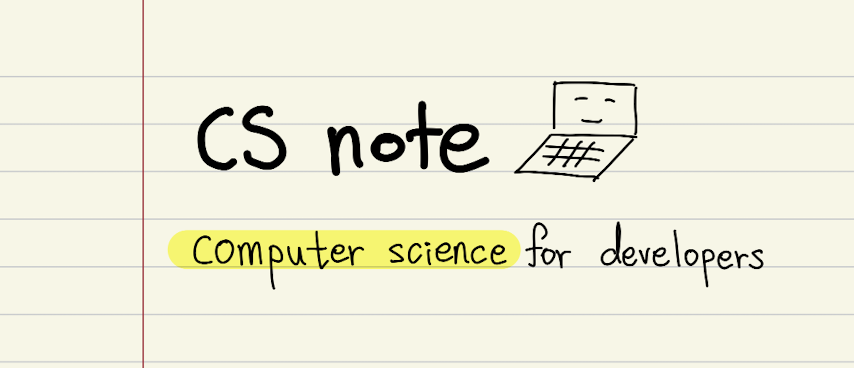
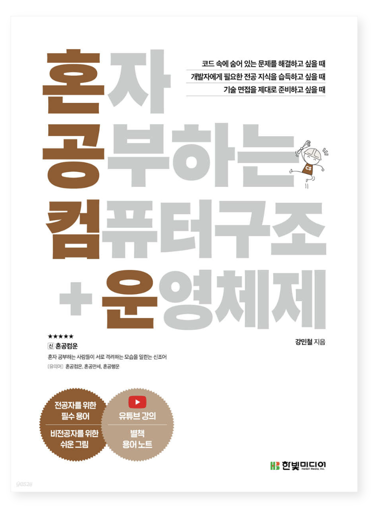
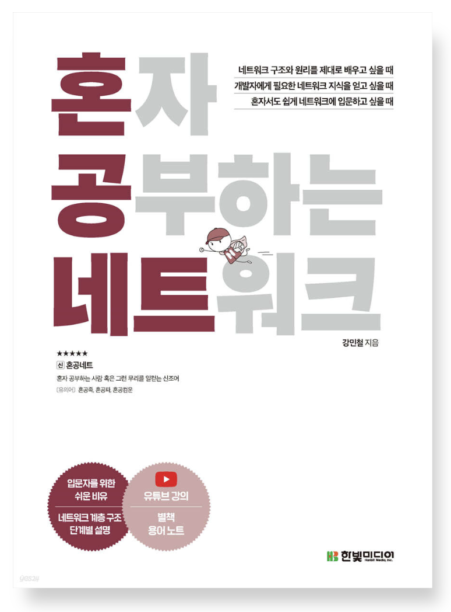
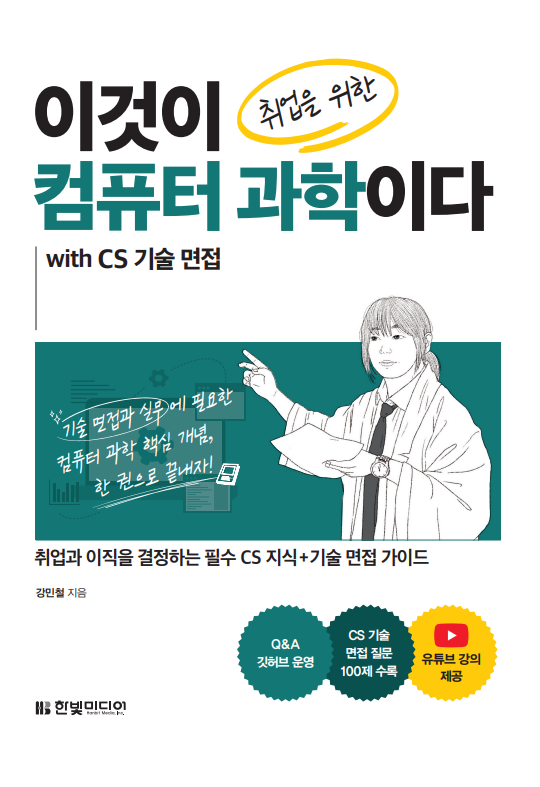
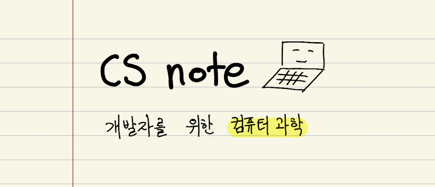

  <button onclick="setLanguage('ko')">한국어</button>
  <button onclick="setLanguage('en')">English</button>

  

# CSnote

개발자를 위한 컴퓨터과학(Computer Science) 핵심 키워드 노트

# 사용 방법

1. 상단의 [과목]을 누릅니다
2. 공부하고자 하는 과목을 선택합니다
3. 공부합니다
4. 필요하다면 상단 검색 기능을 이용합니다

본 사이트는 지속적으로 컨텐츠가 갱신될 수 있습니다.  
어떤 부분이 바뀌었는지는 이 페이지 최하단의 'Last modified'와 'Version'으로 알 수 있습니다.  
'Last modified' 링크를 클릭하면 어떤 부분이 바뀌었는지도 확인 가능합니다.

# 자세히 학습하기

csnote는 '자세한 용어 정리 자료'이지만,  
각 용어 관련 <b>자세한 원리</b>, <b>용어 간의 관계</b>에 대한 설명은 포함되어 있지 않습니다.  

학습의 완성도를 높이고 싶다면  
제작자의 [집필 서적](https://minchul.net/publications/)이나 [무료 강의](https://minchul.net/lectures/)를 참고해 주세요.  

  
  
  
   
   
  <figcaption align="center">▴ 기본 개념 학습
  </figcaption>

  
  
  <figcaption align="center">▴ 용어 정리
  </figcaption>

# 도움을 주신 분

최정혜님(@jeonghye-choi)

# 도움을 주는 방법

[csnote 기여 안내](https://github.com/kangtegong/csnote/blob/main/CONTRIBUTING.md)

# 문의

tegongkang at gmail dot com
